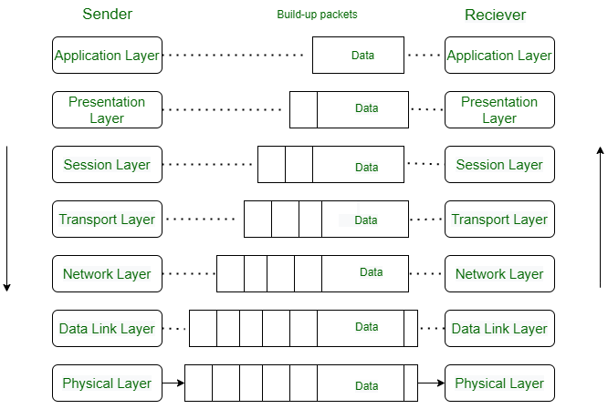
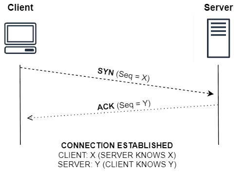
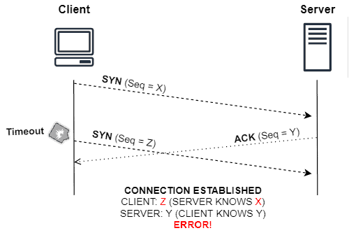
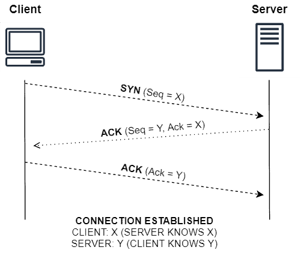

# OSI

## What is Network Protocol?
A network protocol is a set of rules that govern data communication between different devices in the network. It determines what is being communicated, how it is being communicated, and when it is being communicated. It permits connected devices to communicate with each other, irrespective of internal and structural differences.

The Open Systems Interconnection (OSI), the most widely used model, illustrates how computer systems interact with one another over a network. The communication mechanism between two network devices is shown by seven different layers in the OSI model. Every layer in the OSI model works based on different network protocols. At every layer, one or more protocols are there for network communication.

* Ethernet: A widely used protocol for local area networks (LANs) that defines how data is transmitted over cables.

* TCP/IP (Transmission Control Protocol/Internet Protocol): The foundation of the internet, TCP/IP provides reliable, ordered, and error-checked delivery of data packets over networks.

* HTTP (Hypertext Transfer Protocol): The protocol used for transmitting hypermedia documents, such as HTML files, over the World Wide Web.

* HTTPS (Hypertext Transfer Protocol Secure): An extension of HTTP that adds a layer of encryption using SSL/TLS to secure data transmission over the internet.

* SMTP (Simple Mail Transfer Protocol): Used for sending emails between servers.

* DNS (Domain Name System): Translates domain names into IP addresses, allowing users to access websites using easy-to-remember names.

* FTP (File Transfer Protocol): Used for transferring files between a client and a server on a computer network.

## What is OSI Model?
The OSI model is a reference framework that explains the process of transmitting data between computers. It is divided into seven layers that work together to carry out specialised network functions, allowing for a more systematic approach to networking.

## What are the 7 layers of the OSI Model?
The OSI model consists of seven abstraction layers arranged in a top-down order:

### Physical Layer
This is the lowest layer of the OSI model and deals with the physical connection between devices. It defines the electrical, mechanical, and functional specifications for transmitting data over a physical medium.

### Data Link Layer
This layer is responsible for node-to-node communication, ensuring data packets are delivered error-free. It handles error detection and correction, as well as the framing and flow control of data.

The Data Link Layer is divided into two sublayers:  
* Logical Link Control (LLC)
* Media Access Control (MAC)

### Network Layer
The network layer enables communication between different networks by routing data packets from the source to the destination. It determines the best path for data transmission, performs logical addressing, and handles packet forwarding.

### Transport Layer
This layer ensures reliable end-to-end communication between devices. It segments and reassembles data into packets, provides error-checking mechanisms, and manages flow control to prevent data loss or congestion.

Services Provided by Transport Layer 
1. Connection-Oriented Service: It is a three-phase process that includes
    * Connection Establishment
    * Data Transfer
    * Termination/disconnection
2. Connectionless Service

### Session Layer
The session layer establishes, maintains, and terminates connections between devices. It manages session synchronization, checkpointing, and recovery, allowing users to establish sessions for data exchange.

### Presentation Layer
This layer is responsible for data translation, encryption, and compression to ensure that data sent from the application layer of one system can be read by the application layer of another system. It deals with data formatting, syntax, and semantics.

### Application Layer
The application layer is the topmost layer and interacts directly with end-users or applications. It provides network services and interfaces for user applications, including protocols such as HTTP, FTP, SMTP, and DNS.

## Advantages of OSI Model
The OSI Model defines the communication of a computing system into 7 different layers. Its advantages include:

* It divides network communication into 7 layers which makes it easier to understand and troubleshoot.
* It standardizes network communications, as each layer has fixed functions and protocols.
* Diagnosing network problems is easier with the OSI model.
* It is easier to improve with advancements as each layer can get updates separately.
______
## What is Routing?
Routers are networking devices operating at layer 3 or a network layer of the OSI model. They are responsible for receiving, analysing, and forwarding data packets among the connected computer networks. When a data packet arrives, the router inspects the destination address, consults its routing tables to decide the optimal route and then transfers the packet along this route.

## What Is Switching?
Switches are devices that connect devices within a network. Switching uses switches to forward data from one device to another. Switches use Media Access Control (MAC) addresses to determine the destination of incoming data and forward it accordingly.

> The process of sending packets from one host to another within a LAN is called switching. The process of doing that between two or more LANs is called routing.  
A switch is a Layer 2 device (Data-Link Layer), while a router is a Layer 3 device (Network Layer).
______
## Handshakes
Handshaking is a typical action in which our devices/processes execute handshake protocols to establish connections with other devices or processes. In such a way, connected devices can exchange messages with the appropriate parameters and rules agreed by all the parties involved in a specific communication.

In simple terms, connecting parties with a handshaking protocol means defining how the communication will occur. Specifically, handshaking can establish, before full communication beginning, the protocol for exchanging messages, data encoding, and maximum transfer rates.

### Two-Way Handshake

The two-way handshake is a simple protocol to create a connection between two parties that want to communicate. In order to do that, this protocol uses synchronization (SYN) and acknowledgment (ACK) messages.

To accomplish the two-way handshaking considering a client/server model, the client sends an SYN message to the server with a sequence number X. Then, the server should acknowledge (ACK) the SYN message, providing another sequence number Y and establishing the connection. Thus, sequence number X will acknowledge messages from the client to the server, while sequence number Y will acknowledge messages from the server to the client.

Particularly, the two-way handshake presents potential problems when the ACK message from the server delays too much. Thus, if a connection timeout occurs, the client sends another SYN message with a new sequence number (Z, for example) to the server. However, if the server previously sent an ACK (which is delayed), it’ll discard this new SYN message. The client, in turn, receives the delayed ACK and assumes that it refers to the last sent SYN message. Here’s where the error happens: the client will send messages with the sequence number Z, while the server expects messages following the sequence number X.

### Three-Way Handshake

Like two-way handshaking, three-way handshaking also establishes connections between two parties using SYN and ACK messages. However, besides providing their sequence numbers, the server and client acknowledge the sequence numbers from each other. This sequence number acknowledgment avoids the occurrence of SYN duplication errors.

So, let’s consider that a client wants to communicate with a server that employs the three-way handshaking protocol. First, the client sends an SYN message with your sequence number (X) to the server. The server replies with an SYN-ACK containing its sequence (Y) number and acknowledging the client’s sequence number (X). After that, the client sends an ACK message to confirm the server’s sequence number (Y), finally establishing the connection.

______
## What is an IP & IP Address?
Internet protocol is just a set of rules that makes the internet work. You are able to read this article because your computer or phone has a unique address where the page that you requested has been delivered successfully.

An IP address is a unique address that is used to identify computers or nodes on the internet. This address is just a string of numbers written in a certain format. It is generally expressed in a set of numbers for example 192.155.12.1.  
A full IP address ranges from 0.0.0.0 to 255.255.255.255.

### Types of IP address
1. IPv4: Internet Protocol version 4. It consists of 4 numbers separated by the dots.
2. IPv6: Internet Protocol version 6. It is written as a group of 8 hexadecimal numbers separated with colons(:).
______

## References
* [MARVEL Website](https://hub.uvcemarvel.in)
* [G4G - Protocols](https://www.geeksforgeeks.org/types-of-network-protocols-and-their-uses/)
* [G4G - IP address](https://www.geeksforgeeks.org/what-is-an-ip-address/)