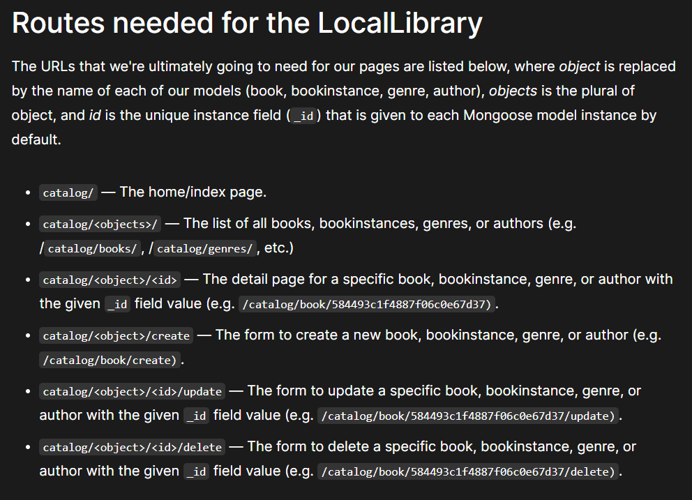

# Resource Library Website

The Library Resources Management Website project aims to streamline the management and access of library resources through an intuitive and user-friendly online platform. The website facilitates efficient cataloging, searching, borrowing, and returning of library materials.

## Key features of website

### Library Dashboard
Keeps track of total number of books and thier copies in the library along with authour and genre information. 

### Cataloging and Classification
Library materials are organized systematically. Each item is assigned a unique identifier and categorized based on genre, author, title, and other relevant attributes.

### User Account Management
User can view their place holds on available & unavailable items, and update their contact information/preferences. Overdue items, upcoming due dates, and other relevant updates are notified with respect to each instance of the book.

### Search and Browse Capabilities
Users can search for library materials using various criteria such as title, author, genre, ISBN, and publishers.
______

## Prerequisites
Before starting this task we need to understand server-side web programming and web frameworks, programming concepts and JavaScript basics.

## Technologies Used
1. NodeJS / ExpressJS (Back-end web application framework )
2. Pug / Jade templating engine (Rendering Dynamic content)
3. MongoDB Atlas (Cloud Database)
4. Mongoose ODM
5. Git & GitHub (Version Control)
6. Glitch (Production Environment and Hosting platform)

### ExpressJS
Express.js is a back-end web application framework for Node.js. It is used to develop a broad range of web and mobile applications. It is built on top of Node.js and helps manage servers and routes.




### Pug
Pug. js, formerly known as Jade, is a templating engine designed to render HTML in server-side technologies such as Node. js. Like any JavaScript templating engine, Pug. js supports writing reusable HTML code and rendering dynamic data.

### MongoDB
MongoDB is a schema-less NoSQL document database. It means you can store JSON documents in it, and the structure of these documents can vary as it is not enforced like SQL databases. This is one of the advantages of using NoSQL as it speeds up application development and reduces the complexity of deployments.

MongoDB Atlas is a cloud database service that helps developers deploy, manage, and scale MongoDB in the cloud.


### Mongoose
Mongoose is an Object Data Modeling (ODM) library for MongoDB and Node.js. It manages relationships between data, provides schema validation, and is used to translate between objects in code and the representation of those objects in MongoDB.


### Git & GitHub
Git is a popular version control system.It is used for, tracking code changes, tracking who made changes, Coding collaboration.

GitHub is the largest host of source code in the world, GitHub makes tools that use Git.

### Glitch

Glitch is an online IDE for JavaScript and Node. js with and includes production environment, instant hosting and automated deployment.
_____

## Quick Start

To get this project up and running locally on your computer:

1. Set up a Node.js development environment.

2. Once you have node setup install the project in the root of your clone of this [repo](https://github.com/DARSHANSV15/Local-Library) :
    ```
    npm install
    ```
3. Run the tutorial server, using the appropriate command line shell for your environment:
    ```
    # Linux terminal
    DEBUG=express-locallibrary-tutorial:* npm run devstart

    # Windows Powershell
    $ENV:DEBUG = "express-locallibrary-tutorial:*"; npm start
    ```
4. Open a browser to http://localhost:3000/ to open the library site.
_____